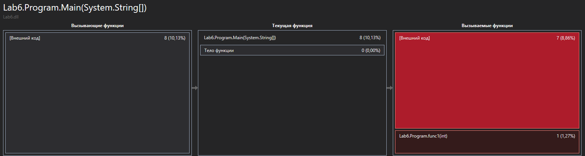
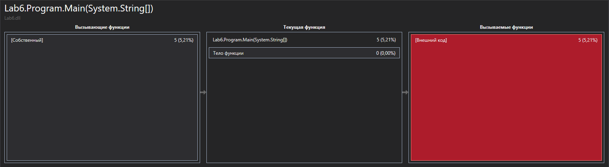

# OS Lab 6 - Program profiling


## Main part


Задание нашей лабораторной работы -оптимизировать код и показать производительность программы. Для этого я использвал встроенное средство диагностики Visual Studio.


### Старая версия
```
    static bool func1(int a)
		{
			for (int i = 0; i < 100000000; i++)
			{
				Thread.Sleep(1);
				if (i > a)
					return true;

			}
			return false;
		}

        static bool func2()
        {
            for (int i = 0; i < 10; i++)
            {
                Thread.Sleep(10000000);
            }
            return true;
        }

		static void Main(string[] args)
        {
			string typeOfShape;
			Console.WriteLine("\n Inside main()\n");
			typeOfShape = Console.ReadLine();

			int i = 0;

			for (; i < 10; i++) ;
			{
				for (int j = 10; j > 0; j--)
				{
					if (func1(i) || func2())
					{
						Console.WriteLine("\n Inside if()\n");
					}
				}
			}
		}
```

### Оптимизированная версия

```
    class Program
    {
		static void Main(string[] args)
        {					
			Console.WriteLine("\n Inside main()\n");
			string typeOfShape = Console.ReadLine();
								
			for (int j = 10; j > 0; j--)
			{					
				Console.WriteLine("\n Inside if()\n");					
			}			
		}
    }
```

### Тесты производительности




